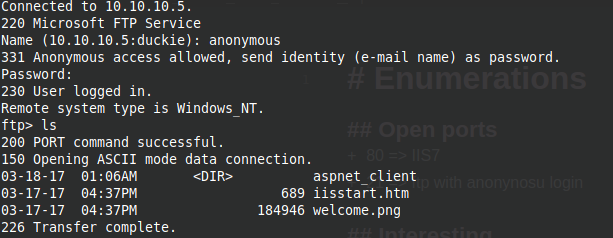
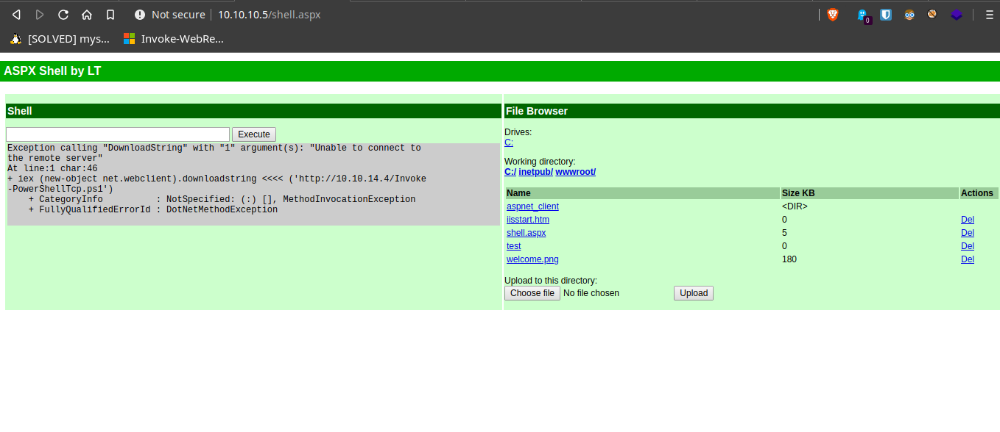
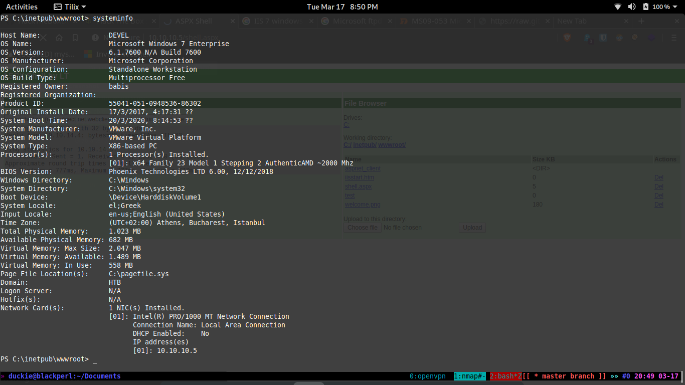
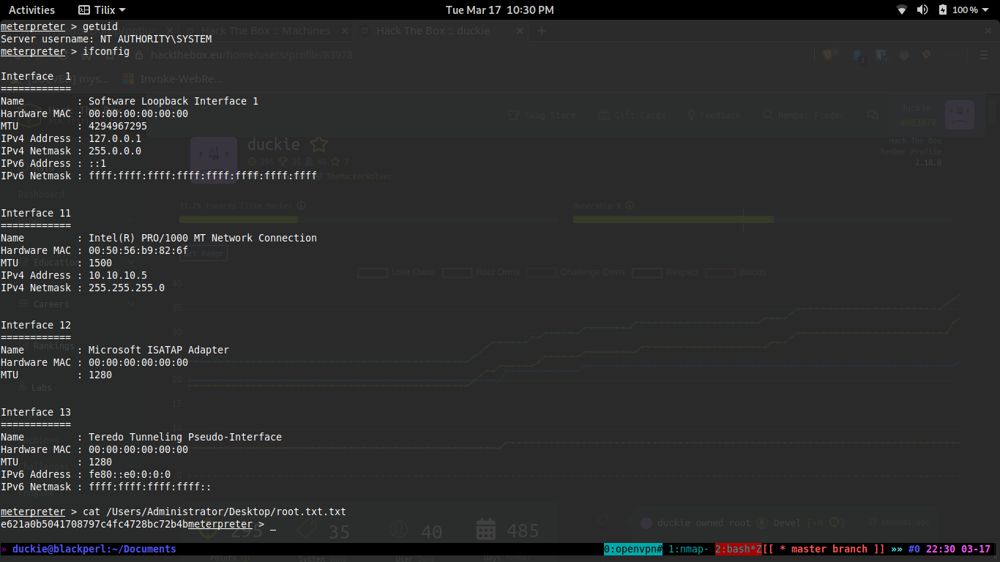

# DEVEL

The Devel box was also simple windows box in which we find FTP listening o port 21 which has anonymous login allowed that allows us to put file on the server. The ftp files were on hosted by web service IIS 7 port 80. We place a aspx shell through ftp get RCE then do privesc on windows 7 box with MS15-051.

## Nmap Scan

we will run a nmap scan to find all the open ports on the sever, to do run the following command.

```bash
namp -sC -sV -oN nmap/devel 10.10.10.5
```

which get us the following output,

```bash
# Nmap 7.80 scan initiated Tue Mar 17 20:25:42 2020 as: nmap -sC -sV -oN nmap/devel 10.10.10.5
Nmap scan report for 10.10.10.5
Host is up (0.35s latency).
Not shown: 998 filtered ports
PORT   STATE SERVICE VERSION
21/tcp open  ftp     Microsoft ftpd
| ftp-anon: Anonymous FTP login allowed (FTP code 230)
| 03-18-17  01:06AM       <DIR>          aspnet_client
| 03-17-17  04:37PM                  689 iisstart.htm
|_03-17-17  04:37PM               184946 welcome.png
| ftp-syst: 
|_  SYST: Windows_NT
80/tcp open  http    Microsoft IIS httpd 7.5
| http-methods: 
|_  Potentially risky methods: TRACE
|_http-server-header: Microsoft-IIS/7.5
|_http-title: IIS7
Service Info: OS: Windows; CPE: cpe:/o:microsoft:windows

Service detection performed. Please report any incorrect results at https://nmap.org/submit/ .
# Nmap done at Tue Mar 17 20:28:17 2020 -- 1 IP address (1 host up) scanned in 154.73 seconds
```

we see FTP and Web Server on port 80 is open. Since anonymous login is allowed on ftp lets start from there.

## FTP

Using the ftp command, we login with username anonymous and password anything to view the files.



Since we have write permissions on the server, (can be test by uploading any file on it with ``` put ``` command), lets upload a aspx shell to get **RCE**.

```bash
put shell.aspx
```

which gave us, the RCE as follows



## Privilege Escalation

Upgraded the RCE to a full meterpreter shell with hat manual exploit. found this from systeminfo



Ran Sherlock.ps1 to find relevant exploits, found MS15-051 to be working to give root exploit. Used binary available from [here](https://github.com/SecWiki/windows-kernel-exploits/tree/master/MS15-051) . Which gave us the system shell.


